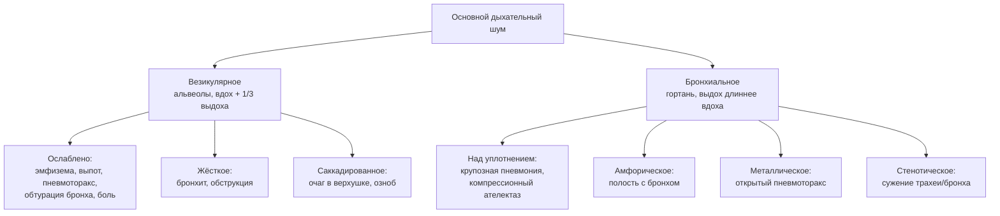
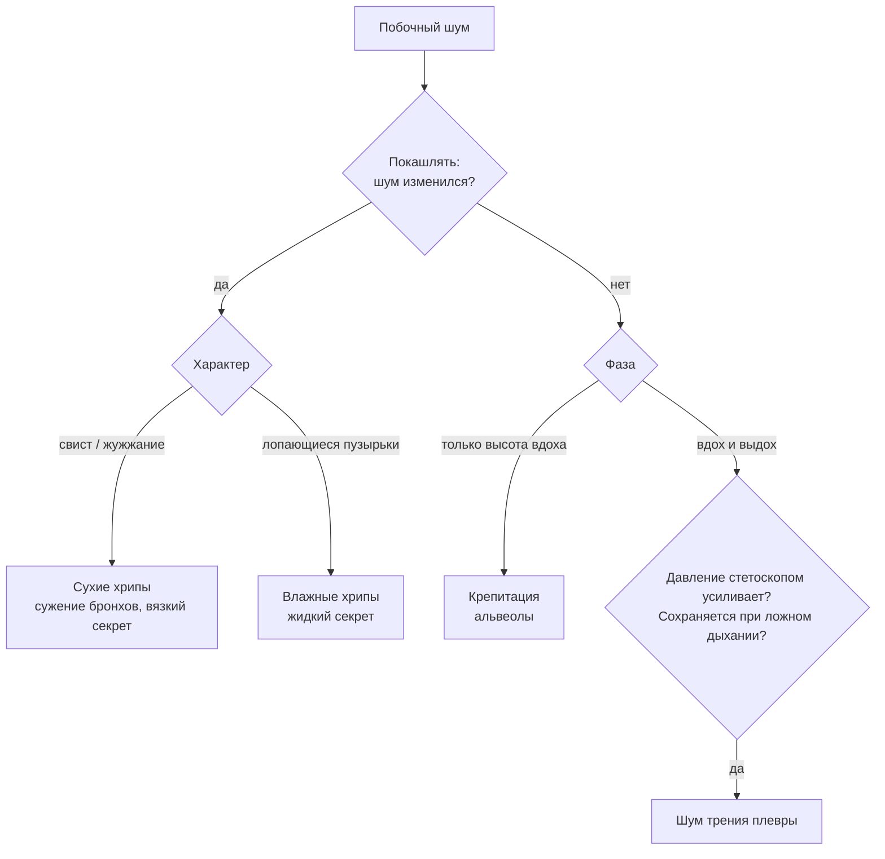

> [!abstract] Цели занятия
> После конспекта я могу:
> - провести аускультацию лёгких в правильном порядке и по симметричным точкам;
> - описать основной дыхательный шум: везикулярное или бронхиальное дыхание и их варианты;
> - объяснить механизм каждого варианта и назвать, при каких состояниях он бывает;
> - отличить сухие и влажные хрипы, крепитацию и шум трения плевры — четырьмя приёмами у постели;
> - проверить бронхофонию и объяснить, когда она усилена и когда ослаблена.

## 1. Основной материал

> [!info] Внешний источник: развёрнутое описание механизмов и примеров
> Методичка кафедры («Методика обследования больного», ЧувГУ, 2005) даёт для этой темы только схему описания: основной дыхательный шум → побочные шумы → бронхофония. Основной учебник по ПВБ — **Гребенев А.Л. «Пропедевтика внутренних болезней»**, но его файла в библиотеке пока нет: текст ниже — общепринятые сведения курса пропедевтики, **с Гребеневым ещё не сверен** [проверить по Гребеневу]. Классификация и порядок — как в методичке кафедры.

### 1.1. Техника аускультации (auscultatio)

- **Условия.** Тихое тёплое помещение. Больной стоит или сидит, руки опущены (при выслушивании боковых отделов — руки за голову). Тяжёлого больного выслушивают лёжа, поворачивая на бок.
- **Дыхание.** Больной дышит **ртом**, чуть глубже обычного, без шума. Через нос дыхание даёт посторонние звуки.
- **Инструмент.** Стетоскоп (stethoscopium) или фонендоскоп прижимают плотно всей поверхностью к коже. Волосы на груди смачивают — трение о них имитирует крепитацию.
- **Правило симметрии.** Выслушивают **сначала справа, затем в симметричной точке слева**, в каждой точке — 2–3 полных дыхательных цикла (и вдох, и выдох).
- **Порядок** — сверху вниз, спереди → сбоку → сзади (см. [[#Схема 1. Точки аускультации лёгких|схему 1]]).

**Где именно ставить стетоскоп** [межреберья сверить с Гребеневым]:

| № на схеме | Область | Точное место | Линия |
|---|---|---|---|
| 1 | надключичная (fossa supraclavicularis) | ямка над ключицей — проекция верхушки лёгкого | — |
| 2 | подключичная (fossa infraclavicularis) | I межреберье, сразу под ключицей | среднеключичная |
| 3 | передняя поверхность | II межреберье (ориентир — угол грудины = место прикрепления II ребра) | среднеключичная |
| 4 | передняя поверхность | III межреберье; **слева ниже не идём — там сердце** | среднеключичная |
| 5–6 | передняя поверхность **справа** | IV и V межреберья (до нижней границы — VI ребро) | среднеключичная |
| 7 | подмышечная (fossa axillaris) | глубина подмышечной ямки; руки больного за голову | — |
| 8 | боковая поверхность | IV, V, VI, VII межреберья | средняя подмышечная |
| 9 | надлопаточная (fossa supraspinata) | над остью лопатки — задняя проекция верхушки | — |
| 10 | межлопаточное пространство | 3 уровня: вверху, в середине, внизу — между позвоночником и медиальным краем лопатки; больной скрещивает руки на груди, чтобы лопатки разошлись | паравертебральная |
| 11 | подлопаточная | VII, VIII, IX межреберья — ниже угла лопатки (угол ≈ VII ребро) | лопаточная |

> [!nb] NB! Правила, без которых аускультация не засчитывается
> - **Всегда пара:** точка справа → **та же точка слева**. Ценность аускультации — в **сравнении сторон**.
> - В каждой точке — **минимум 2–3 полных цикла** «вдох + выдох».
> - Больной дышит **ртом**, чуть глубже обычного.
> - Слева спереди **ниже III межреберья не слушаем** — там сердце.
- **Что оценивать** (схема кафедры): 1) основной дыхательный шум; 2) побочные (дополнительные) дыхательные шумы; 3) бронхофонию.

### 1.2. Основные дыхательные шумы

#### Везикулярное (альвеолярное) дыхание — respiratio vesicularis

- **Механизм.** Возникает в альвеолах: на вдохе воздух расправляет альвеолы, их эластичные стенки напрягаются и колеблются. Сумма этих колебаний — мягкий дующий шум, похожий на звук «ф», произнесённый на вдохе.
- **Фазы.** Слышно **весь вдох** и только **первую треть выдоха** (в начале выдоха стенки ещё колеблются, затем быстро затихают).

> [!nb] NB!
> Везикулярное = «ф», **вдох длиннее выдоха** (весь вдох + 1/3 выдоха). Бронхиальное = «х», **выдох длиннее и громче вдоха**. Это первое, что спросят.
- **Где в норме.** Над всей поверхностью лёгких, кроме зон, где проводится бронхиальное дыхание (см. ниже). Громче — в нижних отделах спереди, в подмышечных и подлопаточных областях (больше лёгочной ткани). Тише — у верхушек и у тучных людей (толстая грудная стенка).
- **Пуэрильное дыхание** (respiratio puerilis) — физиологически усиленное везикулярное у детей: тонкая стенка, эластичная ткань.

**Изменения везикулярного дыхания при патологии** (экз. вопрос 14):

| Изменение | Механизм | Примеры |
|---|---|---|
| **Ослабление** — от уменьшения количества или эластичности альвеол | меньше колеблющихся стенок | эмфизема лёгких; начальная стадия крупозной пневмонии (воспалительный отёк стенок) |
| **Ослабление** — от уменьшения поступления воздуха | мало воздуха в альвеолы | сужение гортани, трахеи; обтурация бронха (начало ателектаза) |
| **Ослабление** — от малой экскурсии | лёгкое мало расправляется | боль (сухой плеврит, перелом рёбер), высокое стояние диафрагмы, ожирение |
| **Ослабление** — от плохого проведения звука | препятствие между лёгким и стетоскопом | жидкость или воздух в плевральной полости, утолщение плевры, толстая грудная стенка |
| **Отсутствие** | воздух не поступает или звук не проводится | полный обтурационный ателектаз; большой выпот; пневмоторакс со спавшимся лёгким |
| **Усиление** (на вдохе и выдохе) | компенсаторно | над здоровым лёгким, когда больное не работает |
| **Жёсткое дыхание** | неравномерное сужение мелких бронхов (отёк слизистой, секрет) → к альвеолярному звуку добавляется грубый бронхиальный компонент; выдох **громкий и удлинённый** | бронхит, бронхиальная обструкция |
| **Саккадированное** (прерывистое, respiratio saccadata) | вдох идёт толчками — неравномерное сужение мелких бронхов в ограниченном участке, альвеолы расправляются не одновременно | очаговый процесс в верхушке (исторически — туберкулёз); также при ознобе, при неравномерном сокращении дыхательных мышц |

> [!tip] Как запомнить
> **Везикулярное** — «место встречи»: сколько альвеол, сколько в них идёт воздуха и насколько хорошо звук проходит до уха. Любая из трёх ступеней сломана → ослабление.

#### Бронхиальное (ларинготрахеальное) дыхание — respiratio bronchialis

- **Механизм.** Образуется в **гортани**: воздух проходит через узкую голосовую щель, за ней — завихрения. Звук грубый, похож на «х».
- **Фазы.** Слышно и на вдохе, и на выдохе; **выдох громче, грубее и длиннее вдоха** (на выдохе голосовая щель уже).
- **Где в норме.** Над гортанью и трахеей, над рукояткой грудины, в межлопаточном пространстве вверху — до уровня III–IV грудного позвонка [проверить уровень по Гребеневу]. Над остальной поверхностью лёгких в норме его не слышно: воздушная ткань лёгкого его гасит.

**Патологическое бронхиальное дыхание** — слышно там, где в норме везикулярное (экз. вопрос 15). Условие одно: **лёгочная ткань стала хорошо проводить звук** или появилась **резонирующая полость**.

> [!nb] NB!
> Формула патологического бронхиального дыхания: **безвоздушная (уплотнённая) ткань + проходимый бронх**. Бронх закрыт (обтурационный ателектаз) → дыхания **нет**.

| Разновидность | Когда | Механизм |
|---|---|---|
| **Бронхиальное дыхание над уплотнением** | крупозная пневмония (стадия опеченения), инфаркт лёгкого, компрессионный ателектаз (лёгкое поджато выпотом сверху над уровнем жидкости) | безвоздушная ткань при проходимом бронхе хорошо проводит ларинготрахеальный звук |
| **Амфорическое** (respiratio amphorica) | гладкостенная полость, сообщающаяся с бронхом: абсцесс после опорожнения, каверна | резонанс в полости → глухой звук «как дуть над горлышком пустого кувшина» |
| **С металлическим оттенком** | открытый пневмоторакс | резонанс в большой полости с напряжёнными стенками |
| **Стенотическое** | сужение трахеи или крупного бронха (опухоль, инородное тело) | **усиленное** бронхиальное дыхание в местах, где оно слышно в норме |
| **Смешанное** (везикулобронхиальное, бронховезикулярное) | очаговая пневмония, начальная инфильтрация; пневмосклероз | участки уплотнения вперемешку с воздушной тканью: вдох — ближе к везикулярному, выдох — к бронхиальному |

> [!warning] Ловушка
> Над **большим выпотом** дыхание **ослаблено или отсутствует**, а над **зоной поджатого лёгкого выше уровня жидкости** — может быть бронхиальным (компрессионный ателектаз). То есть при плеврите «всё тихо» внизу и «бронхиальное» чуть выше.

### 1.3. Побочные (дополнительные) дыхательные шумы

По схеме кафедры: сухие и влажные хрипы, крепитация, шум трения плевры; реже — плевроперикардиальный шум, шум плеска Гиппократа, шум падающей капли, шум водяной дудки. Для каждого указывают **область, межреберье и топографическую линию**.

#### Хрипы (rhonchi) — экз. вопрос 16

**Сухие хрипы (rhonchi sicci)**

- **Где образуются:** в бронхах, при их **сужении** (спазм, отёк слизистой) или при наличии **вязкой мокроты** в виде нитей и перемычек, которые колеблются струёй воздуха.
- **Высота зависит от калибра бронха:**
  - **высокие — свистящие** (дискантовые, rhonchi sibilantes) — мелкие бронхи и бронхиолы;
  - **низкие — жужжащие** (басовые, rhonchi sonori) — крупные и средние бронхи.
- **Фазы:** на вдохе и выдохе; при обструкции — **больше на выдохе**.
- Меняются **после кашля** (могут появиться, исчезнуть, изменить тембр и число). Низкие басовые хрипы иногда ощущаются ладонью (см. методичку: «вибрация грудной клетки при сухих хрипах низкого тона»).
- **Когда:** бронхиальная астма, обструктивный бронхит (ХОБЛ), бронхит.

**Влажные хрипы (rhonchi humidi)**

- **Где образуются:** в бронхах или полостях с **жидким секретом** (мокрота, кровь, транссудат): воздух проходит через жидкость, образует пузырьки, они лопаются.
- **Калибр пузырьков:**
  - **мелкопузырчатые** — бронхиолы, мелкие бронхи;
  - **среднепузырчатые** — средние бронхи;
  - **крупнопузырчатые** — крупные бронхи, полости (каверна, абсцесс).
- **Звучные (консонирующие)** — если вокруг бронха **уплотнённая** ткань (пневмония, пневмосклероз) или они образуются в **резонирующей полости**: звук проводится хорошо, слышен «близко к уху».
- **Незвучные** — вокруг воздушная ткань: застой в малом круге (сердечная недостаточность), бронхит.
- **Фазы:** на **вдохе** (скорость воздуха выше) и отчасти на выдохе.
- **После кашля** меняются (секрет смещается).

#### Крепитация (crepitatio) — экз. вопрос 17

- **Где:** в **альвеолах**, не в бронхах.
- **Механизм:** на стенках альвеол — небольшое количество **вязкого экссудата**; на выдохе они слипаются, **на высоте вдоха одновременно разлипаются** → короткий треск.
- **Звук:** похож на треск растираемых у уха волос, на хруст снега.
- **Фазы:** **только на высоте вдоха**, короткой «вспышкой».
- **После кашля:** **не меняется** (секрет в альвеолах, а не в бронхах).
- **Когда:**
  - крупозная пневмония: **crepitatio indux** — начальная (стадия прилива), **crepitatio redux** — в стадии разрешения;
  - инфаркт лёгкого, начальная стадия отёка лёгких, пневмониты;
  - **физиологическая** («ателектатическая») — у долго лежавших людей в нижних отделах при первых глубоких вдохах; после нескольких вдохов исчезает.

#### Шум трения плевры — экз. вопрос 18

- **Механизм:** листки плевры в норме гладкие и увлажнены; при **отложении фибрина** или других шероховатостях они трутся друг о друга с шумом.
- **Когда:** сухой (фибринозный) плеврит; плеврит в начале экссудативного и при рассасывании выпота; обезвоживание (сухость листков); уремия (в методичке — «шум трения плевры … при терминальной стадии почечной недостаточности»); опухолевое поражение плевры.
- **Звук:** скрип снега, шелест бумаги, «скрип новой кожи»; прерывистый, **слышен «близко к уху»**.
- **Фазы:** **и на вдохе, и на выдохе**.
- Место: чаще **нижнебоковые отделы** (наибольшая экскурсия лёгких — по подмышечным линиям).
- Нередко **болезнен** и иногда **ощущается ладонью**.

### 1.4. Как отличить побочные шумы (главная таблица темы)

> [!nb] NB!
> Четыре приёма у постели: **1) фаза дыхания · 2) покашлять · 3) надавить стетоскопом · 4) ложные дыхательные движения.** Хрипы меняются от кашля; крепитация — только на высоте вдоха; трение плевры усиливается от давления и **остаётся при ложном дыхании**.

| Признак | Сухие хрипы | Влажные хрипы | Крепитация | Шум трения плевры |
|---|---|---|---|---|
| Где образуется | бронхи (сужение, вязкий секрет) | бронхи, полости (жидкий секрет) | альвеолы | плевра |
| Фаза дыхания | вдох и выдох (при обструкции — больше выдох) | преимущественно вдох | **только высота вдоха** | **вдох и выдох** |
| После кашля | **меняются** | **меняются** | не меняется | не меняется |
| Надавить стетоскопом | не меняются | не меняются | не меняется | **усиливается** |
| Ложные дыхательные движения (рот и нос закрыты, больной двигает животом/диафрагмой) | исчезают | исчезают | исчезает | **сохраняется** (листки плевры смещаются) |
| Характер звука | свист, жужжание | лопающиеся пузырьки | однородный треск «вспышкой» | неоднородный скрип, «у самого уха» |

> [!tip] Алгоритм у постели
> 1. Попросить **покашлять** → изменилось? Значит, бронхи (хрипы).
> 2. Не изменилось → **только высота вдоха**, однородный треск? Крепитация.
> 3. Слышно в обе фазы, усиливается при **нажатии стетоскопом**, остаётся при **ложных дыхательных движениях**? Шум трения плевры.

### 1.5. Бронхофония (bronchophonia)

- **Техника:** больной **шёпотом** произносит слова с шипящими и «ч» («чашка чая»); выслушивают симметричные точки.
- **Норма:** над лёгкими слышно неразборчиво и одинаково с обеих сторон.
- **Усилена** (слова различимы): уплотнение лёгочной ткани при проходимом бронхе (пневмония, инфаркт лёгкого, компрессионный ателектаз), полость, сообщающаяся с бронхом.
- **Ослаблена/отсутствует:** жидкость или воздух в плевральной полости, обтурационный ателектаз, эмфизема, выраженное утолщение плевры.
- **Смысл:** бронхофония — «аускультативный двойник» голосового дрожания: меняется по тем же причинам, но выявляет более мелкие очаги.

## 2. Схемы

### Схема 1. Точки аускультации лёгких

![[05-auskultaciya-legkih-1.svg]]

*Схема, не в масштабе. Сверить: атлас Неттера — грудная клетка, проекции лёгких и плевры на грудную стенку. Номера — порядок обхода (расшифровка — в таблице раздела 1.1); цвет: бирюзовый — спереди, оранжевый — сбоку, фиолетовый — сзади; синий пунктир — нижняя граница лёгких.*

### Схема 2. Где рождается звук

![[05-auskultaciya-legkih-2.svg]]

*Схема, не в масштабе: одно лёгкое, ветвление бронхов упрощено. Сверить: атлас Неттера — трахея и бронхиальное дерево, плевра.*

### Схема 3. Что я слышу → где источник

### Схема 4. Дифференциальная диагностика побочных шумов

## 3. Клиническая связь

> [!nb] NB!
> Крупозная пневмония «проходит» весь словарь темы: **прилив** — ослабленное везикулярное + crepitatio indux → **опеченение** — бронхиальное дыхание, усиленная бронхофония → **разрешение** — crepitatio redux.

**Крупозная пневмония** — классика темы, потому что за одну болезнь меняется почти весь аускультативный «словарь». В стадии прилива — ослабленное везикулярное дыхание и начальная крепитация (crepitatio indux). В стадии опеченения альвеолы заполнены экссудатом, ткань безвоздушная, а бронх проходим: слышно бронхиальное дыхание и усиленная бронхофония, звучные влажные хрипы. В стадии разрешения экссудат рассасывается — снова крепитация (crepitatio redux), дыхание постепенно возвращается к везикулярному.

**Бронхиальная обструкция** (астма, ХОБЛ): жёсткое дыхание с удлинённым выдохом и сухими свистящими хрипами на выдохе. Опасный признак — когда при тяжёлом приступе хрипы и дыхательный шум **исчезают**: воздух почти не проходит («немое лёгкое»), это не улучшение.

**Сердечная недостаточность по левожелудочковому типу:** застой в малом круге даёт незвучные мелкопузырчатые влажные хрипы в нижних отделах с обеих сторон. При нарастании отёка лёгких хрипы поднимаются выше, становятся крупнее.

**Травма груди.** У пострадавшего с переломами рёбер дыхание на стороне травмы ослаблено уже из-за боли. Но **резкое ослабление или отсутствие дыхательного шума с одной стороны** после травмы — повод немедленно думать о **пневмотораксе или гемотораксе**; при открытом пневмотораксе дыхание может приобретать металлический оттенок. Аускультация здесь — быстрый прикроватный скрининг до рентгена.

## 4. Сверх программы

> [!tip] Сверх программы: международная номенклатура звуков
> Источник: номенклатура ERS (Pasterkamp et al., *Eur Respir J*, 2016 — [проверить выходные данные]).
> В англоязычной литературе русские термины сопоставляются так: **crackles** (fine / coarse) ≈ влажные хрипы + крепитация; **wheezes** ≈ свистящие сухие хрипы; **rhonchi** ≈ низкие (жужжащие) сухие хрипы; **pleural friction rub** ≈ шум трения плевры; **stridor** ≈ стенотическое дыхание верхних путей. Отдельного термина «крепитация» в этой номенклатуре нет — это **fine crackles**. На паре используй кафедральные термины.

> [!tip] Сверх программы: «велкро»-хрипы
> Источник: уровень USMLE / клинические обзоры по интерстициальным болезням лёгких.
> Поздние инспираторные fine crackles, похожие на звук расстёгиваемой липучки (velcro crackles), в базальных отделах — типичны для **идиопатического лёгочного фиброза**. Ранние инспираторные coarse crackles — чаще при бронхоэктазах и ХОБЛ.

> [!tip] Сверх программы: эгофония и шёпотная пекторилоквия
> Источник: уровень USMLE (физикальная диагностика).
> Над уплотнением лёгкого звук «и» (ee) при аускультации слышится как «э/а» (**egophony**, «E → A change»), а шёпот — отчётливо (**whispered pectoriloquy**). По смыслу это те же признаки, что усиленная бронхофония.

> [!tip] Сверх программы: почему выдох при обструкции длиннее
> Источник: физиология дыхания (уровень First Aid).
> На выдохе внутригрудное давление растёт и **сжимает мелкие бронхи** снаружи; если они уже сужены, выдох становится медленным и шумным. Поэтому при астме и ХОБЛ хрипы и удлинение выдоха — главный аускультативный признак.

## 5. Экзаменационные вопросы

**14. Везикулярное дыхание и его изменения при патологии.**
1. Определение и механизм: колебания стенок альвеол при их расправлении.
2. Характеристика: мягкое «ф», весь вдох + 1/3 выдоха.
3. Где в норме громче и тише; пуэрильное дыхание.
4. Ослабление: мало альвеол/эластичности (эмфизема), мало воздуха (обтурация, стеноз), малая экскурсия (боль, диафрагма), плохое проведение (выпот, воздух, утолщённая плевра).
5. Отсутствие: обтурационный ателектаз, большой выпот, пневмоторакс.
6. Усиление: компенсаторное.
7. Жёсткое: неравномерное сужение мелких бронхов, громкий удлинённый выдох (бронхит).
8. Саккадированное: толчкообразный вдох (очаг в верхушке; озноб).
→ Схемы 2 и 3.

**15. Бронхиальное дыхание, его разновидности. Диагностическое значение.**
1. Механизм: завихрения воздуха за голосовой щелью.
2. Характеристика: «х», выдох громче и длиннее вдоха.
3. Где в норме: гортань, трахея, рукоятка грудины, межлопаточно вверху.
4. Патологическое: над уплотнением при проходимом бронхе (крупозная пневмония, инфаркт лёгкого, компрессионный ателектаз).
5. Амфорическое: гладкостенная полость, сообщающаяся с бронхом.
6. Металлическое: открытый пневмоторакс.
7. Стенотическое: сужение трахеи/крупного бронха.
8. Смешанное (везикулобронхиальное): очаговое уплотнение.
→ Схемы 2 и 3.

**16. Хрипы (их отличия от других побочных дыхательных шумов).**
1. Место образования — бронхи/полости.
2. Сухие: сужение бронха, вязкий секрет; свистящие (мелкие бронхи) и жужжащие (крупные).
3. Влажные: жидкий секрет, пузырьки; мелко-, средне-, крупнопузырчатые.
4. Звучные — при уплотнении/полости; незвучные — застой, бронхит.
5. Фазы: сухие — вдох и выдох; влажные — больше вдох.
6. Отличие: меняются после кашля; не усиливаются от давления стетоскопом; исчезают при ложных дыхательных движениях.
7. Примеры: астма, ХОБЛ; пневмония; застой при левожелудочковой недостаточности.
→ Схемы 2 и 4, таблица 1.4.

**17. Крепитация (её отличие от других побочных дыхательных шумов).**
1. Место — альвеолы.
2. Механизм — разлипание слипшихся стенок альвеол с небольшим количеством вязкого экссудата.
3. Звук — однородный треск (растирание волос).
4. Только на высоте вдоха.
5. Не меняется после кашля.
6. Отличие от мелкопузырчатых хрипов: не меняется после кашля, только высота вдоха, однородная.
7. Когда: крупозная пневмония (indux, redux), инфаркт лёгкого, начало отёка лёгких; физиологическая у лежачих.
→ Схемы 2 и 4.

**18. Шум трения плевры (её отличие от других побочных дыхательных шумов).**
1. Механизм — трение шероховатых листков плевры (фибрин).
2. Причины — сухой плеврит, начало и разрешение экссудативного, обезвоживание, уремия, опухоль плевры.
3. Звук — скрип снега, шелест; «близко к уху»; прерывистый.
4. Вдох и выдох; чаще нижнебоковые отделы.
5. Усиливается при давлении стетоскопом.
6. Сохраняется при ложных дыхательных движениях (главное отличие).
7. Не меняется после кашля; нередко болезнен, может ощущаться ладонью.
→ Схемы 2 и 4, таблица 1.4.

## 6. English

| EN | RU | Пример |
|---|---|---|
| auscultation | аускультация | *Lung auscultation revealed decreased breath sounds on the right.* |
| breath sounds | дыхательные шумы | *Breath sounds were symmetrical and vesicular.* |
| vesicular breath sounds | везикулярное дыхание | *Normal vesicular breath sounds were heard over both lung fields.* |
| bronchial breathing | бронхиальное дыхание | *Bronchial breathing over the right lower lobe suggests consolidation.* |
| decreased / absent breath sounds | ослабленное / отсутствующее дыхание | *Absent breath sounds on the left after chest trauma — suspect pneumothorax.* |
| prolonged expiration | удлинённый выдох | *Prolonged expiration with wheezes is typical of asthma.* |
| wheeze | свистящий хрип | *Expiratory wheezes were heard throughout both lungs.* |
| rhonchi | низкие (жужжащие) хрипы | *Rhonchi cleared after coughing.* |
| crackles (fine / coarse) | влажные хрипы, крепитация | *Fine bibasal crackles in a patient with heart failure.* |
| pleural friction rub | шум трения плевры | *A pleural friction rub was heard in the left axillary area.* |
| consolidation | уплотнение (лёгочной ткани) | *Chest X-ray confirmed right lower lobe consolidation.* |
| pleural effusion | плевральный выпот | *Dullness and absent breath sounds over the effusion.* |
| bronchophony | бронхофония | *Increased bronchophony over the consolidated area.* |
| stethoscope | стетоскоп | *Place the diaphragm of the stethoscope firmly on the skin.* |

## 7. Выжимка для переписывания

**Порядок:** спереди (надключичные → подключичные → по среднеключичным) → бока (подмышечные линии) → сзади (надлопаточные → межлопаточно → подлопаточные). Всегда **справа → слева** в симметричной точке. Больной дышит **ртом**, чуть глубже. Схема — [[#Схема 1. Точки аускультации лёгких|схема 1]].

**Описание по кафедре:** 1) основной шум; 2) побочные шумы (где: область, межреберье, линия); 3) бронхофония.

**Везикулярное** — альвеолы; «ф»; весь вдох + 1/3 выдоха.
- Ослаблено: эмфизема · обтурация/стеноз · боль/диафрагма · выпот, воздух, толстая плевра.
- Отсутствует: обтурационный ателектаз, большой выпот, пневмоторакс.
- Жёсткое: бронхит (выдох громкий, длинный).
- Саккадированное: толчками (очаг в верхушке, озноб).

**Бронхиальное** — гортань; «х»; выдох > вдоха. Норма: гортань, трахея, рукоятка грудины, межлопаточно вверху.
- Патология = уплотнение + проходимый бронх (крупозная пневмония, инфаркт, компрессионный ателектаз).
- Амфорическое — полость с бронхом. Металлическое — открытый пневмоторакс. Стенотическое — сужение трахеи/бронха. Смешанное — очаги.

**Побочные шумы — 4 теста:**

| | сухие хр. | влажные хр. | крепитация | трение плевры |
|---|---|---|---|---|
| фаза | вдох+выдох | вдох | высота вдоха | вдох+выдох |
| кашель | меняет | меняет | нет | нет |
| давление | — | — | — | усиливает |
| ложное дыхание | исчезают | исчезают | исчезает | остаётся |

- Сухие: свистящие (мелкие бронхи), жужжащие (крупные). Астма, ХОБЛ.
- Влажные: мелко-/средне-/крупнопузырчатые; звучные (уплотнение, полость) / незвучные (застой).
- Крепитация: альвеолы разлипаются; indux и redux при крупозной пневмонии.
- Трение плевры: фибрин; сухой плеврит, уремия; «у уха», нижнебоковые отделы.

**Бронхофония** (шёпот «чашка чая»): ↑ уплотнение, полость; ↓ выпот, воздух, ателектаз обтурационный, эмфизема.

## 8. Самопроверка

> [!question]- У больного внизу справа тупость, дыхание не выслушивается, а чуть выше уровня тупости — бронхиальное дыхание. Что это?
> Экссудативный плеврит (выпот): над жидкостью дыхание отсутствует, а выше её лёгкое поджато — компрессионный ателектаз, ткань безвоздушная при проходимых бронхах, поэтому бронхиальное дыхание.

> [!question]- Как одним приёмом отличить шум трения плевры от крепитации и хрипов?
> Ложные дыхательные движения (рот и нос закрыты, больной двигает животом): шум трения плевры сохраняется, потому что листки плевры смещаются; хрипы и крепитация исчезают, потому что воздух не движется.

> [!question]- Чем крепитация отличается от мелкопузырчатых влажных хрипов?
> Крепитация — только на высоте вдоха, однородный треск, не меняется после кашля (альвеолы). Мелкопузырчатые хрипы — на протяжении вдоха, неоднородные, меняются после кашля (бронхи).

> [!question]- Почему при эмфиземе дыхание ослаблено?
> Альвеолы перерастянуты и теряют эластичность, часть межальвеолярных перегородок разрушена — меньше колеблющихся стенок; плюс повышенная воздушность хуже проводит звук.

> [!question]- Какое дыхание при открытом пневмотораксе и почему?
> Бронхиальное с металлическим оттенком (или резко ослабленное): звук резонирует в большой полости с напряжёнными стенками.

## Источники

- `_библиотека/propedevtika/методички/propedevtika-metodika-obsledovaniya-bolnogo-2005.doc` — «Методика обследования больного», ЧувГУ, 2005: раздел «Аускультация лёгких» (схема описания: основной шум, побочные шумы, бронхофония); упоминание шума трения плевры при терминальной почечной недостаточности.
- `_библиотека/propedevtika/тематический-план/propedevtika-tematicheskiy-plan-2026.doc` — тема занятия 5.
- `_система/экзамен-вопросы/propedevtika.md` — вопросы 14–18 (перечень кафедры 2024/25).
- Основной учебник (ещё не сверен, файла нет в `_библиотека/`): Гребенев А.Л. «Пропедевтика внутренних болезней» [проверить издание и сверить разделы об аускультации].
- Внешний: общепринятые сведения курса пропедевтики внутренних болезней (механизмы и разновидности дыхательных шумов, точки аускультации).
- Внешний: Pasterkamp H. et al. «Towards the standardisation of lung sound nomenclature». *Eur Respir J*, 2016 [проверить выходные данные].
